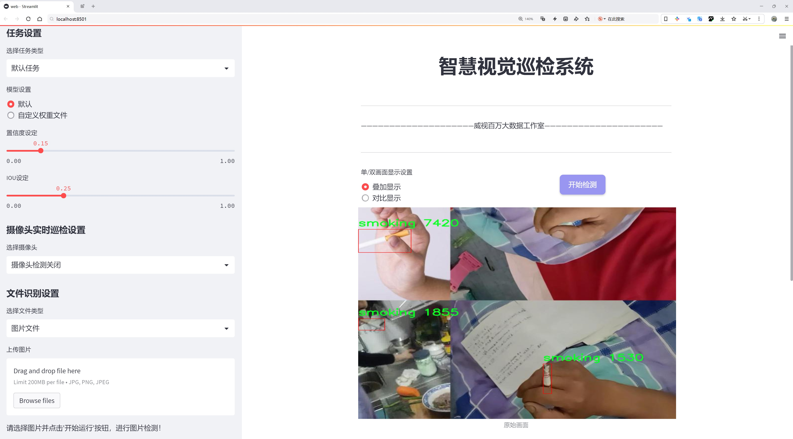
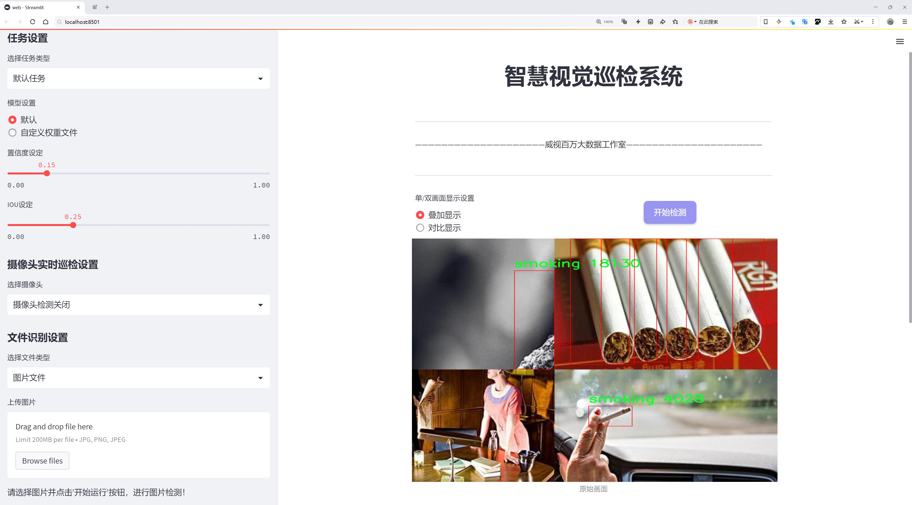
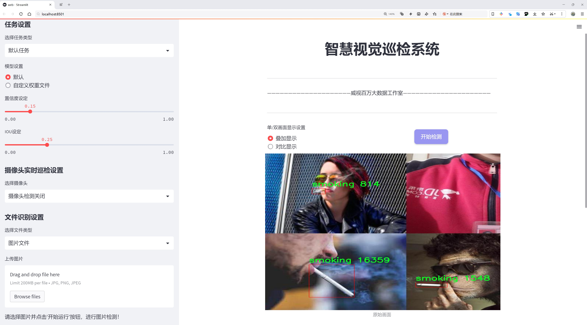
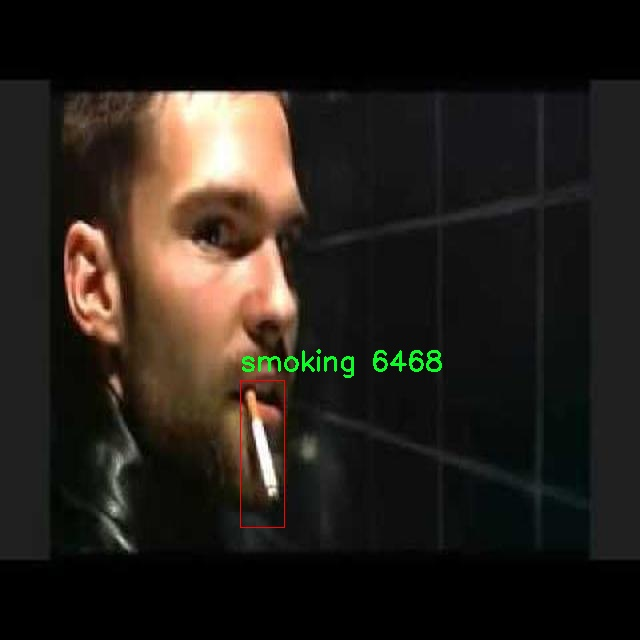
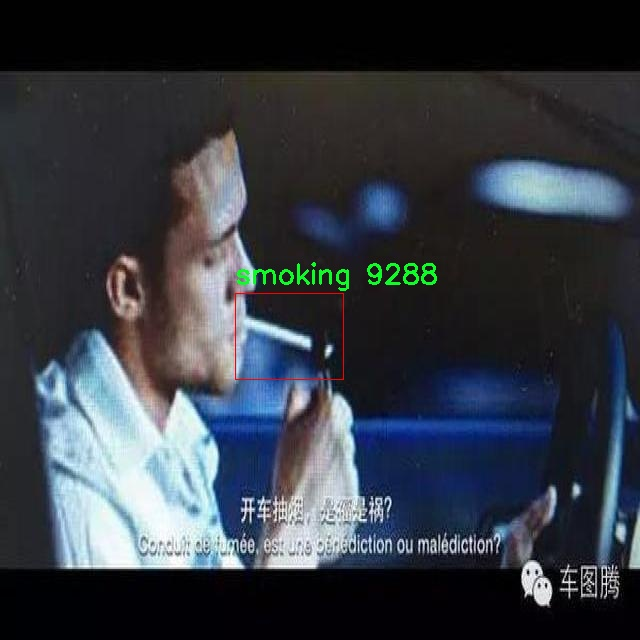
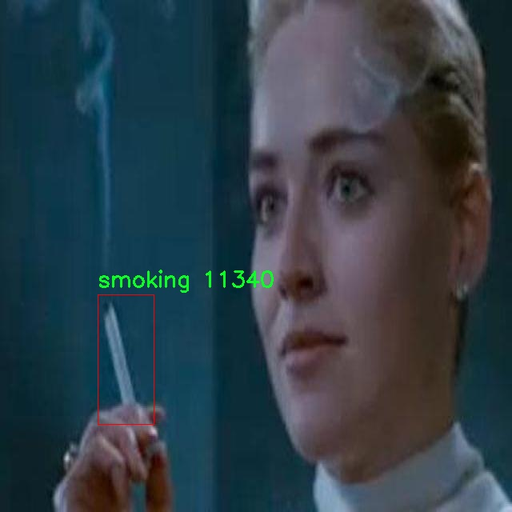
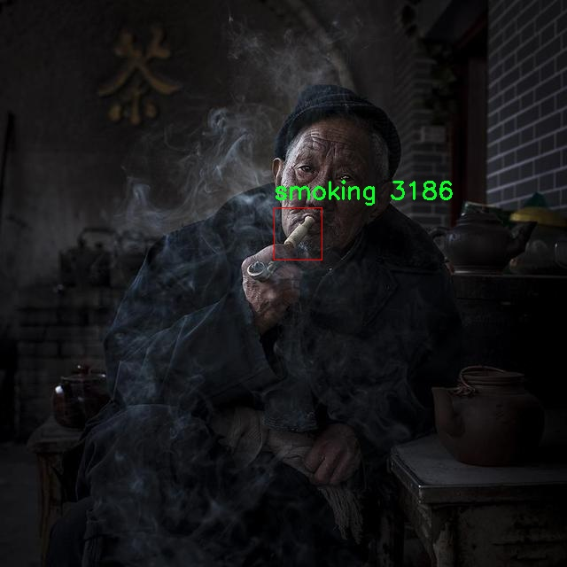

# 吸烟行为检测系统源码分享
 # [一条龙教学YOLOV8标注好的数据集一键训练_70+全套改进创新点发刊_Web前端展示]

### 1.研究背景与意义

项目参考[AAAI Association for the Advancement of Artificial Intelligence](https://gitee.com/qunmasj/projects)

研究背景与意义

随着社会对公共健康的重视，吸烟行为的监测与干预逐渐成为全球范围内的重要课题。吸烟不仅对吸烟者本人造成严重的健康危害，还对周围人群的健康构成威胁，尤其是青少年和儿童。因此，开发有效的吸烟行为监测系统，对于推动公共健康政策的实施、减少吸烟率、提高公众对吸烟危害的认识具有重要意义。近年来，计算机视觉技术的快速发展为吸烟行为的自动检测提供了新的可能性，尤其是基于深度学习的目标检测算法，如YOLO（You Only Look Once）系列模型，因其高效性和准确性而受到广泛关注。

YOLOv8作为YOLO系列的最新版本，具备了更强的特征提取能力和更快的推理速度，能够在复杂环境中实时检测目标。针对吸烟行为的监测，YOLOv8的应用潜力巨大。通过对特定场景下吸烟行为的自动识别，可以为公共场所的禁烟政策执行提供数据支持，同时也为吸烟者提供自我监测的工具，促进其戒烟意愿。为了实现这一目标，构建一个高质量的吸烟行为数据集至关重要。在本研究中，我们使用了名为“Smoking123”的数据集，该数据集包含7755张图像，专注于吸烟这一单一类别，旨在为YOLOv8模型的训练和评估提供丰富的样本。

数据集的构建与选择直接影响到模型的性能。Smoking123数据集的图像数量和类别设置，使得模型能够在特定场景下学习到吸烟行为的特征，从而提高检测的准确性和鲁棒性。通过对这些图像进行标注和分类，YOLOv8能够有效地识别出吸烟行为，进而实现实时监测。这一研究不仅具有理论意义，还具有实际应用价值。通过将改进的YOLOv8模型应用于公共场所的监测系统，可以实时获取吸烟行为的数据，为政策制定者提供科学依据，推动禁烟政策的落实。

此外，吸烟行为的自动检测系统还可以与其他健康监测系统相结合，形成综合的健康管理平台。通过数据的积累与分析，能够深入了解吸烟行为的变化趋势，为健康教育和干预措施的制定提供数据支持。同时，基于深度学习的目标检测技术在其他领域的应用也将得到启示，推动计算机视觉技术的进一步发展。

综上所述，基于改进YOLOv8的吸烟行为监测系统的研究，不仅为吸烟行为的自动检测提供了新的技术路径，也为公共健康的改善和吸烟率的降低提供了有效的解决方案。通过本研究，我们期望能够为未来的健康监测技术发展奠定基础，并为社会的健康福祉贡献一份力量。

### 2.图片演示







##### 注意：由于此博客编辑较早，上面“2.图片演示”和“3.视频演示”展示的系统图片或者视频可能为老版本，新版本在老版本的基础上升级如下：（实际效果以升级的新版本为准）

  （1）适配了YOLOV8的“目标检测”模型和“实例分割”模型，通过加载相应的权重（.pt）文件即可自适应加载模型。

  （2）支持“图片识别”、“视频识别”、“摄像头实时识别”三种识别模式。

  （3）支持“图片识别”、“视频识别”、“摄像头实时识别”三种识别结果保存导出，解决手动导出（容易卡顿出现爆内存）存在的问题，识别完自动保存结果并导出到。

  （4）支持Web前端系统中的标题、背景图等自定义修改，后面提供修改教程。

  另外本项目提供训练的数据集和训练教程,暂不提供权重文件（best.pt）,需要您按照教程进行训练后实现图片演示和Web前端界面演示的效果。

### 3.视频演示

[3.1 视频演示](https://www.bilibili.com/video/BV1sssLeuEYB/?vd_source=ff015de2d29cbe2a9cdbfa7064407a08)

### 4.数据集信息展示

数据集信息展示

在现代计算机视觉领域，吸烟行为的检测与识别已成为一个重要的研究方向。为此，我们引入了名为“Smoking123”的数据集，该数据集专门用于训练和改进YOLOv8模型，以实现对吸烟行为的精准检测。Smoking123数据集包含了7755张高质量的图像，所有图像均围绕着一个特定的类别——吸烟。这一类别的设定不仅使得数据集在特定应用场景下具有针对性，同时也为模型的训练提供了丰富的样本支持。

数据集中的图像涵盖了多种不同的场景和环境，包括室内和室外的吸烟行为，确保了模型在多样化场景下的适应性。每张图像都经过精心标注，确保模型在训练过程中能够准确学习到吸烟行为的特征。这种精确的标注不仅提高了模型的检测精度，也为后续的应用提供了可靠的数据基础。

Smoking123数据集的设计遵循了开放数据的原则，采用了CC BY 4.0许可证。这意味着研究人员和开发者可以自由使用、修改和分享该数据集，前提是给予适当的署名。这种开放性不仅促进了学术界和工业界的合作，也推动了吸烟行为检测技术的快速发展。研究人员可以在此基础上进行进一步的研究，探索更为复杂的行为识别任务，甚至将其应用于公共健康监测、环境保护等领域。

此外，Smoking123数据集的单一类别设定使得模型的训练过程更加聚焦，避免了多类别任务中常见的混淆和干扰。通过专注于吸烟这一行为，YOLOv8模型能够在特征提取和分类决策上进行更深层次的学习，从而提升检测的准确性和实时性。这一特性对于实际应用尤为重要，尤其是在需要快速响应的场景中，如公共场所的监控系统。

值得一提的是，随着YOLOv8模型的不断优化，结合Smoking123数据集的训练，将使得吸烟行为的检测不仅限于图像识别，还可以扩展到视频流的实时分析。这为未来的智能监控系统奠定了基础，使得公共场所的吸烟行为能够被及时识别和处理，从而有效地推动公共健康政策的实施。

总之，Smoking123数据集为吸烟行为的检测提供了一个丰富且高质量的基础，结合YOLOv8模型的强大能力，必将推动这一领域的研究和应用向前发展。通过不断的迭代和优化，研究人员能够在此基础上开发出更为先进的检测系统，为改善公共健康和环境保护贡献力量。










### 5.全套项目环境部署视频教程（零基础手把手教学）

[5.1 环境部署教程链接（零基础手把手教学）](https://www.ixigua.com/7404473917358506534?logTag=c807d0cbc21c0ef59de5)


[5.2 安装Python虚拟环境创建和依赖库安装视频教程链接（零基础手把手教学）](https://www.ixigua.com/7404474678003106304?logTag=1f1041108cd1f708b01a)

### 6.手把手YOLOV8训练视频教程（零基础小白有手就能学会）

[6.1 环境部署教程链接（零基础手把手教学）](https://www.ixigua.com/7404477157818401292?logTag=d31a2dfd1983c9668658)

### 7.70+种全套YOLOV8创新点代码加载调参视频教程（一键加载写好的改进模型的配置文件）

[7.1 环境部署教程链接（零基础手把手教学）](https://www.ixigua.com/7404478314661806627?logTag=29066f8288e3f4eea3a4)

### 8.70+种全套YOLOV8创新点原理讲解（非科班也可以轻松写刊发刊，V10版本正在科研待更新）

由于篇幅限制，每个创新点的具体原理讲解就不一一展开，具体见下列网址中的创新点对应子项目的技术原理博客网址【Blog】：


[8.1 70+种全套YOLOV8创新点原理讲解链接](https://gitee.com/qunmasj/good)

### 9.系统功能展示（检测对象为举例，实际内容以本项目数据集为准）

图1.系统支持检测结果表格显示

  图2.系统支持置信度和IOU阈值手动调节

  图3.系统支持自定义加载权重文件best.pt(需要你通过步骤5中训练获得)

  图4.系统支持摄像头实时识别

  图5.系统支持图片识别

  图6.系统支持视频识别

  图7.系统支持识别结果文件自动保存

  图8.系统支持Excel导出检测结果数据


### 10.原始YOLOV8算法原理

原始YOLOv8算法原理

YOLOv8算法是目标检测领域的最新进展，承载着YOLO系列算法的演变与创新。作为一种高效的实时目标检测算法，YOLOv8在设计上融合了多种先进的网络结构和技术，旨在提高检测精度和速度，满足日益增长的应用需求。该算法的核心思想是通过精简网络结构和优化计算流程，以实现更快的推理速度和更高的检测准确率。

在YOLOv8的架构中，依然延续了跨级结构（Cross Stage Partial, CSP）的设计理念，这一设计的初衷是为了在保持模型性能的同时，减少计算量和内存占用。与前代YOLOv5相比，YOLOv8对C3模块进行了优化，采用了更轻量的C2f模块。C2f模块通过引入更多的残差连接，使得网络在训练过程中能够获得更丰富的梯度信息，从而提升了特征提取的能力。这种设计不仅增强了模型的表达能力，还有效地减轻了计算负担，使得YOLOv8在保持高性能的同时，具备了更快的推理速度。

在特征提取方面，YOLOv8采用了CSPDarknet作为主干网络，利用多个残差块进行特征提取。该网络结构将输入特征图分为两个分支，分别经过卷积层进行降维处理，并在最后通过卷积层进行特征融合。这种分支结构使得模型能够在多个层次上捕捉到丰富的特征信息，从而提升了对不同尺度目标的检测能力。此外，YOLOv8还引入了快速空间金字塔池化（SPPF）结构，以有效提取不同尺度的特征，进一步增强了模型的多尺度检测能力。

YOLOv8在检测头部分的设计上也进行了创新，采用了流行的解耦合头结构，将分类和检测任务分开处理。这种设计不仅提高了模型的灵活性，还使得分类和检测的损失计算更加高效。同时，YOLOv8摒弃了传统的Anchor-Based方法，转而采用Anchor-Free的检测方式，直接预测目标的中心点和宽高比例。这一转变不仅减少了Anchor框的数量，降低了计算复杂度，还提高了检测的速度和准确度。

在损失函数的设计上，YOLOv8引入了新的损失策略，以提高模型的训练效果。通过变焦损失计算分类损失，并结合数据平均保真度损失和完美交并比损失来计算边界框损失，这种新的损失计算方式使得模型在训练过程中能够更好地适应复杂的目标检测任务。这种创新的损失策略使得YOLOv8在处理不同类型的目标时，能够保持较高的准确性和鲁棒性。

此外，YOLOv8在数据增强方面也进行了改进，采用了动态Task-Aligned Assigner样本分配策略，并在训练的最后10个epoch中关闭马赛克增强。这一策略旨在通过优化样本分配，提高模型的训练效率，从而在不同场景下实现更好的检测效果。

YOLOv8模型的设计不仅考虑了性能的提升，还关注了模型的可扩展性。根据不同的应用需求，YOLOv8提供了多种规模的模型选择，包括n、s、m、l、x五种不同的模型配置。这种灵活的设计使得用户能够根据具体的场景需求，选择合适的模型进行目标检测，确保在各种环境下都能实现最佳的检测效果。

总的来说，YOLOv8算法通过对网络结构的优化、损失函数的创新以及数据增强策略的改进，展现出了在目标检测领域的强大能力。其高效的特征提取和检测方式，使得YOLOv8不仅在准确度上取得了显著提升，同时也在推理速度上表现出色，成为了当前目标检测任务中的一项重要工具。随着YOLOv8的广泛应用，未来的研究将继续围绕其基础进行深入探索，以推动目标检测技术的进一步发展。


### 11.项目核心源码讲解（再也不用担心看不懂代码逻辑）

#### 11.1 ultralytics\nn\modules\utils.py

以下是对代码的核心部分进行提炼和详细注释的结果：

```python
import torch
import torch.nn.functional as F

def multi_scale_deformable_attn_pytorch(
    value: torch.Tensor,
    value_spatial_shapes: torch.Tensor,
    sampling_locations: torch.Tensor,
    attention_weights: torch.Tensor,
) -> torch.Tensor:
    """
    多尺度可变形注意力机制。

    参数:
    - value: 输入特征图，形状为 (bs, C, num_heads, embed_dims)
    - value_spatial_shapes: 特征图的空间形状，形状为 (num_levels, 2)
    - sampling_locations: 采样位置，形状为 (bs, num_queries, num_heads, num_levels, num_points, 2)
    - attention_weights: 注意力权重，形状为 (bs, num_heads, num_queries, num_levels, num_points)

    返回:
    - output: 经过多尺度可变形注意力后的输出，形状为 (bs, num_queries, num_heads * embed_dims)
    """

    # 获取输入的维度信息
    bs, _, num_heads, embed_dims = value.shape  # bs: batch size, C: 通道数
    _, num_queries, _, num_levels, num_points, _ = sampling_locations.shape  # num_queries: 查询数量

    # 将输入特征图按照空间形状拆分成多个特征图
    value_list = value.split([H_ * W_ for H_, W_ in value_spatial_shapes], dim=1)

    # 计算采样网格
    sampling_grids = 2 * sampling_locations - 1  # 将采样位置转换为[-1, 1]范围

    sampling_value_list = []  # 用于存储每个层次的采样值
    for level, (H_, W_) in enumerate(value_spatial_shapes):
        # 将特征图重塑为 (bs * num_heads, embed_dims, H_, W_)
        value_l_ = value_list[level].flatten(2).transpose(1, 2).reshape(bs * num_heads, embed_dims, H_, W_)

        # 将采样网格重塑为 (bs * num_heads, num_queries, num_points, 2)
        sampling_grid_l_ = sampling_grids[:, :, :, level].transpose(1, 2).flatten(0, 1)

        # 使用双线性插值进行采样
        sampling_value_l_ = F.grid_sample(
            value_l_, sampling_grid_l_, mode="bilinear", padding_mode="zeros", align_corners=False
        )
        sampling_value_list.append(sampling_value_l_)

    # 重塑注意力权重为 (bs * num_heads, 1, num_queries, num_levels * num_points)
    attention_weights = attention_weights.transpose(1, 2).reshape(
        bs * num_heads, 1, num_queries, num_levels * num_points
    )

    # 计算最终输出
    output = (
        (torch.stack(sampling_value_list, dim=-2).flatten(-2) * attention_weights)  # 加权采样值
        .sum(-1)  # 在最后一个维度上求和
        .view(bs, num_heads * embed_dims, num_queries)  # 重塑为 (bs, num_heads * embed_dims, num_queries)
    )

    return output.transpose(1, 2).contiguous()  # 转置输出并返回
```

### 代码核心部分分析：
1. **函数定义**：`multi_scale_deformable_attn_pytorch`是实现多尺度可变形注意力机制的核心函数。
2. **输入参数**：
   - `value`：输入特征图，包含多个头和嵌入维度。
   - `value_spatial_shapes`：特征图的空间形状，帮助确定特征图的高度和宽度。
   - `sampling_locations`：用于采样的位置信息，指示从特征图中提取哪些位置的值。
   - `attention_weights`：注意力权重，用于加权采样值。
3. **主要操作**：
   - 将输入特征图拆分为多个特征图，以便进行多尺度处理。
   - 计算采样网格，将采样位置从[0, 1]范围转换为[-1, 1]范围。
   - 使用`F.grid_sample`进行双线性插值，获取在指定采样位置的特征值。
   - 根据注意力权重对采样值进行加权求和，得到最终输出。

### 总结：
该函数实现了多尺度可变形注意力机制，通过对输入特征图进行重塑和采样，结合注意力权重，输出经过加权的特征表示。

这个文件是Ultralytics YOLO项目中的一个工具模块，主要包含了一些用于深度学习模型的实用函数和类。代码的主要功能包括模块的克隆、偏置初始化、线性层的初始化、逆sigmoid函数的计算以及多尺度可变形注意力机制的实现。

首先，文件中导入了一些必要的库，包括`copy`、`math`、`numpy`和`torch`等，这些库提供了实现所需的基础功能。接着，定义了一个`_get_clones`函数，该函数用于根据给定的模块创建一个克隆模块的列表，这在构建深度学习模型时非常有用，可以方便地复制相同的层。

接下来，`bias_init_with_prob`函数用于根据给定的先验概率初始化卷积或全连接层的偏置值。它通过计算负对数几率来返回一个合适的偏置初始化值。

`linear_init`函数则负责初始化线性模块的权重和偏置。它使用均匀分布在一个特定的范围内对权重进行初始化，并在模块存在偏置时对偏置进行同样的初始化。

`inverse_sigmoid`函数计算给定张量的逆sigmoid值。它首先将输入张量限制在0到1之间，然后通过对数运算计算逆sigmoid值，确保在计算过程中避免了数值不稳定的问题。

最后，`multi_scale_deformable_attn_pytorch`函数实现了多尺度可变形注意力机制。该函数接受多个输入，包括值张量、空间形状、采样位置和注意力权重。函数内部首先获取输入张量的形状信息，然后对值张量进行分割，接着计算采样网格，并通过`F.grid_sample`函数对每个尺度的值进行采样。最后，结合注意力权重，计算出最终的输出张量。

总体来说，这个模块提供了一些基础的工具函数和多尺度注意力机制的实现，为YOLO模型的构建和训练提供了支持。

#### 11.2 ultralytics\engine\tuner.py

以下是经过简化和注释的核心代码部分，主要集中在超参数调优的核心逻辑上：

```python
class Tuner:
    """
    负责YOLO模型超参数调优的类。

    该类通过在给定的迭代次数内变异超参数并重新训练模型来评估其性能。
    """

    def __init__(self, args=DEFAULT_CFG, _callbacks=None):
        """
        初始化Tuner，配置超参数调优的相关设置。

        参数:
            args (dict, optional): 超参数演化的配置。
        """
        # 定义超参数搜索空间，包括每个超参数的最小值、最大值和可选的增益
        self.space = args.pop("space", None) or {
            "lr0": (1e-5, 1e-1),  # 初始学习率
            "momentum": (0.7, 0.98, 0.3),  # 动量
            "weight_decay": (0.0, 0.001),  # 权重衰减
            # 其他超参数...
        }
        self.args = get_cfg(overrides=args)  # 获取配置
        self.tune_dir = get_save_dir(self.args, name="tune")  # 保存调优结果的目录
        self.tune_csv = self.tune_dir / "tune_results.csv"  # 结果CSV文件路径
        self.callbacks = _callbacks or callbacks.get_default_callbacks()  # 回调函数
        callbacks.add_integration_callbacks(self)  # 添加集成回调
        LOGGER.info(f"Initialized Tuner instance with 'tune_dir={self.tune_dir}'")

    def _mutate(self):
        """
        根据超参数的边界和缩放因子变异超参数。

        返回:
            dict: 包含变异后超参数的字典。
        """
        # 如果CSV文件存在，选择最佳超参数进行变异
        if self.tune_csv.exists():
            x = np.loadtxt(self.tune_csv, ndmin=2, delimiter=",", skiprows=1)  # 读取CSV文件
            fitness = x[:, 0]  # 获取适应度（fitness）
            n = min(n, len(x))  # 考虑的结果数量
            x = x[np.argsort(-fitness)][:n]  # 选择适应度最高的n个结果
            # 选择父代并进行变异
            # 变异逻辑...
        else:
            # 如果CSV文件不存在，使用默认超参数
            hyp = {k: getattr(self.args, k) for k in self.space.keys()}

        # 限制超参数在指定范围内
        for k, v in self.space.items():
            hyp[k] = max(hyp[k], v[0])  # 下限
            hyp[k] = min(hyp[k], v[1])  # 上限
            hyp[k] = round(hyp[k], 5)  # 保留五位小数

        return hyp

    def __call__(self, model=None, iterations=10, cleanup=True):
        """
        执行超参数演化过程。

        参数:
           model (Model): 预初始化的YOLO模型。
           iterations (int): 演化的代数。
           cleanup (bool): 是否在调优过程中删除迭代权重以减少存储空间。
        """
        for i in range(iterations):
            mutated_hyp = self._mutate()  # 变异超参数
            LOGGER.info(f"Starting iteration {i + 1}/{iterations} with hyperparameters: {mutated_hyp}")

            # 训练YOLO模型并记录适应度
            # 训练逻辑...
            # 保存结果到CSV文件
            # 记录最佳结果...
            # 绘制调优结果图
            # 打印和保存调优结果
```

### 代码注释说明：
1. **类 `Tuner`**：负责超参数调优的核心类，包含初始化和变异超参数的方法。
2. **`__init__` 方法**：初始化时设置超参数搜索空间、配置、保存目录和回调函数。
3. **`_mutate` 方法**：负责变异超参数，依据已有的结果选择父代并进行变异，确保超参数在指定范围内。
4. **`__call__` 方法**：执行超参数演化过程，循环指定的迭代次数，变异超参数，训练模型，记录适应度并保存结果。

以上是代码的核心部分和详细注释，帮助理解超参数调优的过程。

这个程序文件 `ultralytics\engine\tuner.py` 是用于超参数调优的模块，专门针对 Ultralytics YOLO 模型，支持对象检测、实例分割、图像分类、姿态估计和多目标跟踪等任务。超参数调优是一个系统性地搜索最佳超参数集合的过程，以获得最佳的模型性能。在深度学习模型（如 YOLO）中，超参数的微小变化可能会导致模型准确性和效率的显著差异。

文件中定义了一个 `Tuner` 类，负责 YOLO 模型的超参数调优。该类通过在给定的迭代次数内进化超参数，利用变异方法来评估其性能。类的属性包括超参数搜索空间、调优日志和结果保存目录，以及用于记录调优结果的 CSV 文件路径。

在初始化时，`Tuner` 类会设置超参数的搜索空间，包括学习率、动量、权重衰减等多个参数的范围。用户可以通过传入自定义的搜索空间来进行调优。初始化过程中还会设置回调函数，并记录调优的目录和相关信息。

`_mutate` 方法用于根据搜索空间和变异因子对超参数进行变异。它会选择最佳的父超参数并进行变异，确保生成的超参数在指定的范围内，并且避免重复。变异后的超参数会被限制在预设的上下限内。

`__call__` 方法是执行超参数进化过程的核心。它会在指定的迭代次数内执行以下步骤：加载现有的超参数或初始化新的超参数、调用 `_mutate` 方法进行变异、使用变异后的超参数训练 YOLO 模型，并将适应度分数和变异后的超参数记录到 CSV 文件中。训练过程会在子进程中执行，以避免数据加载时的阻塞。

在每次迭代中，程序会记录训练的结果，并检查当前的超参数是否是最佳的。如果是最佳的，程序会保存模型权重和相关信息，并更新最佳超参数的记录。最后，程序会绘制调优结果并输出调优的总结信息，包括最佳适应度、最佳超参数等。

总的来说，这个文件提供了一个完整的超参数调优框架，允许用户通过系统化的方法来优化 YOLO 模型的性能。

#### 11.3 ui.py

```python
import sys
import subprocess

def run_script(script_path):
    """
    使用当前 Python 环境运行指定的脚本。

    Args:
        script_path (str): 要运行的脚本路径

    Returns:
        None
    """
    # 获取当前 Python 解释器的路径
    python_path = sys.executable

    # 构建运行命令
    command = f'"{python_path}" -m streamlit run "{script_path}"'

    # 执行命令
    result = subprocess.run(command, shell=True)
    if result.returncode != 0:
        print("脚本运行出错。")


# 实例化并运行应用
if __name__ == "__main__":
    # 指定您的脚本路径
    script_path = "web.py"  # 这里可以直接指定脚本名称

    # 运行脚本
    run_script(script_path)
```

### 代码详细注释：

1. **导入模块**：
   - `import sys`：导入 `sys` 模块，用于访问与 Python 解释器紧密相关的变量和函数。
   - `import subprocess`：导入 `subprocess` 模块，用于执行外部命令。

2. **定义函数 `run_script`**：
   - `def run_script(script_path)`：定义一个函数，接受一个参数 `script_path`，表示要运行的脚本的路径。

3. **获取 Python 解释器路径**：
   - `python_path = sys.executable`：获取当前 Python 解释器的完整路径，这样可以确保使用正确的 Python 环境来运行脚本。

4. **构建运行命令**：
   - `command = f'"{python_path}" -m streamlit run "{script_path}"'`：构建一个命令字符串，使用 `streamlit` 模块运行指定的脚本。这里使用了 f-string 格式化字符串，以便将变量插入到命令中。

5. **执行命令**：
   - `result = subprocess.run(command, shell=True)`：使用 `subprocess.run` 执行构建的命令。`shell=True` 允许在 shell 中执行命令。

6. **检查命令执行结果**：
   - `if result.returncode != 0`：检查命令的返回码，如果不为 0，表示脚本运行出错。
   - `print("脚本运行出错。")`：输出错误信息。

7. **主程序入口**：
   - `if __name__ == "__main__":`：确保只有在直接运行该脚本时才会执行以下代码。
   - `script_path = "web.py"`：指定要运行的脚本名称，可以根据需要修改。
   - `run_script(script_path)`：调用 `run_script` 函数，传入脚本路径以执行该脚本。

这个程序文件的主要功能是通过当前的 Python 环境来运行一个指定的脚本，具体是使用 Streamlit 框架来启动一个 Web 应用。程序首先导入了必要的模块，包括 `sys`、`os` 和 `subprocess`，这些模块分别用于访问系统特性、处理文件路径和执行外部命令。

在 `run_script` 函数中，首先获取当前 Python 解释器的路径，这样可以确保使用的是正确的 Python 环境。接着，构建一个命令字符串，这个命令会调用 Streamlit 来运行指定的脚本。这里使用了 `-m streamlit run` 的方式来启动脚本，确保 Streamlit 的相关功能能够正常使用。

然后，使用 `subprocess.run` 方法来执行这个命令。这个方法会在一个新的 shell 中运行命令，并等待其完成。如果命令执行后返回的状态码不为零，表示脚本运行过程中出现了错误，此时会打印出“脚本运行出错”的提示信息。

在文件的最后部分，使用 `if __name__ == "__main__":` 语句来确保只有在直接运行这个文件时才会执行后面的代码。在这里，指定了要运行的脚本路径为 `web.py`，并调用 `run_script` 函数来启动这个脚本。

整体来看，这个程序的结构简单明了，主要功能是通过当前的 Python 环境来启动一个 Streamlit 应用，适合用于开发和测试 Web 应用。

#### 11.4 ultralytics\models\rtdetr\predict.py

以下是代码中最核心的部分，并附上详细的中文注释：

```python
import torch
from ultralytics.data.augment import LetterBox
from ultralytics.engine.predictor import BasePredictor
from ultralytics.engine.results import Results
from ultralytics.utils import ops

class RTDETRPredictor(BasePredictor):
    """
    RT-DETR (Real-Time Detection Transformer) 预测器，扩展自 BasePredictor 类，用于使用百度的 RT-DETR 模型进行预测。

    该类利用视觉变换器的强大功能，提供实时物体检测，同时保持高精度。它支持高效的混合编码和 IoU 感知查询选择等关键特性。
    """

    def postprocess(self, preds, img, orig_imgs):
        """
        对模型的原始预测结果进行后处理，以生成边界框和置信度分数。

        该方法根据置信度和类进行检测过滤（如果在 `self.args` 中指定）。

        参数:
            preds (torch.Tensor): 模型的原始预测结果。
            img (torch.Tensor): 处理后的输入图像。
            orig_imgs (list or torch.Tensor): 原始的、未处理的图像。

        返回:
            (list[Results]): 包含后处理边界框、置信度分数和类标签的 Results 对象列表。
        """
        # 获取预测结果的维度
        nd = preds[0].shape[-1]
        # 将预测结果分割为边界框和分数
        bboxes, scores = preds[0].split((4, nd - 4), dim=-1)

        # 如果输入图像不是列表，则将其转换为 numpy 格式
        if not isinstance(orig_imgs, list):
            orig_imgs = ops.convert_torch2numpy_batch(orig_imgs)

        results = []
        for i, bbox in enumerate(bboxes):  # 遍历每个边界框
            # 将边界框从中心坐标格式转换为四个角坐标格式
            bbox = ops.xywh2xyxy(bbox)
            # 获取每个边界框的最大分数和对应的类
            score, cls = scores[i].max(-1, keepdim=True)
            # 根据置信度过滤边界框
            idx = score.squeeze(-1) > self.args.conf
            # 如果指定了类，则进一步过滤
            if self.args.classes is not None:
                idx = (cls == torch.tensor(self.args.classes, device=cls.device)).any(1) & idx
            # 过滤后的预测结果
            pred = torch.cat([bbox, score, cls], dim=-1)[idx]
            orig_img = orig_imgs[i]
            oh, ow = orig_img.shape[:2]  # 获取原始图像的高度和宽度
            # 将边界框坐标缩放到原始图像的尺寸
            pred[..., [0, 2]] *= ow
            pred[..., [1, 3]] *= oh
            img_path = self.batch[0][i]  # 获取图像路径
            # 将结果添加到列表中
            results.append(Results(orig_img, path=img_path, names=self.model.names, boxes=pred))
        return results

    def pre_transform(self, im):
        """
        在将输入图像送入模型进行推理之前，对其进行预处理。输入图像被调整为方形的长宽比，并进行缩放填充。

        参数:
            im (list[np.ndarray] | torch.Tensor): 输入图像，形状为 (N,3,h,w) 的张量，或 [(h,w,3) x N] 的列表。

        返回:
            (list): 预处理后的图像列表，准备进行模型推理。
        """
        # 创建 LetterBox 对象以进行图像调整
        letterbox = LetterBox(self.imgsz, auto=False, scaleFill=True)
        # 对每个图像进行调整并返回
        return [letterbox(image=x) for x in im]
```

### 代码说明：
1. **RTDETRPredictor 类**：该类用于实现基于 RT-DETR 模型的物体检测预测，继承自 `BasePredictor` 类。
2. **postprocess 方法**：负责对模型的原始预测结果进行后处理，生成最终的边界框和置信度分数，并根据置信度和类进行过滤。
3. **pre_transform 方法**：在推理之前对输入图像进行预处理，确保图像为方形并进行适当的缩放，以适应模型的输入要求。

这个程序文件是用于实现RT-DETR（实时检测变换器）模型的预测功能，继承自基础预测器类`BasePredictor`。RT-DETR模型结合了视觉变换器的优势，能够在保持高准确率的同时实现实时物体检测。文件中包含了模型预测的主要逻辑和一些处理方法。

首先，文件导入了必要的库和模块，包括`torch`、图像增强工具`LetterBox`、基础预测器`BasePredictor`、结果处理类`Results`以及一些实用操作`ops`。RTDETRPredictor类是该文件的核心，提供了对RT-DETR模型的封装。

在类的文档字符串中，简要介绍了RT-DETR模型的功能和使用示例。使用者可以通过传入模型路径和数据源来创建预测器实例，并调用`predict_cli()`方法进行预测。

该类包含两个主要的方法：`postprocess`和`pre_transform`。`postprocess`方法负责对模型的原始预测结果进行后处理，以生成边界框和置信度分数。具体来说，它将模型输出的预测结果分割为边界框和分数，并根据设定的置信度阈值和类别进行过滤。最后，方法返回一个包含后处理结果的列表，每个结果包含原始图像、路径、类别名称和过滤后的边界框。

`pre_transform`方法则用于在将输入图像送入模型进行推理之前进行预处理。它使用`LetterBox`类将输入图像调整为方形并进行缩放，以确保图像符合模型的输入要求。该方法接受一个图像列表或张量，并返回经过预处理的图像列表。

总体而言，这个文件实现了RT-DETR模型的预测功能，提供了从输入图像到输出检测结果的完整流程，包括预处理和后处理步骤，适合需要进行实时物体检测的应用场景。

#### 11.5 train.py

以下是代码中最核心的部分，并附上详细的中文注释：

```python
import os
import torch
import yaml
from ultralytics import YOLO  # 导入YOLO模型库
from QtFusion.path import abs_path  # 导入获取绝对路径的函数

# 设置设备为GPU（如果可用），否则使用CPU
device = "0" if torch.cuda.is_available() else "cpu"

if __name__ == '__main__':  # 确保该模块被直接运行时才执行以下代码
    workers = 1  # 设置数据加载的工作进程数量
    batch = 2    # 设置每个批次的样本数量

    data_name = "data"  # 数据集名称
    # 获取数据集配置文件的绝对路径
    data_path = abs_path(f'datasets/{data_name}/{data_name}.yaml', path_type='current')  
    unix_style_path = data_path.replace(os.sep, '/')  # 将路径格式转换为Unix风格

    # 获取数据集目录路径
    directory_path = os.path.dirname(unix_style_path)
    
    # 读取YAML格式的数据集配置文件
    with open(data_path, 'r') as file:
        data = yaml.load(file, Loader=yaml.FullLoader)
    
    # 如果配置文件中存在'path'项，则修改为数据集目录路径
    if 'path' in data:
        data['path'] = directory_path
        # 将修改后的数据写回YAML文件
        with open(data_path, 'w') as file:
            yaml.safe_dump(data, file, sort_keys=False)

    # 加载YOLOv8模型，指定模型配置文件和任务类型
    model = YOLO(model='./ultralytics/cfg/models/v8/yolov8s.yaml', task='detect')  
    
    # 开始训练模型
    results2 = model.train(  
        data=data_path,  # 指定训练数据的配置文件路径
        device=device,  # 指定训练使用的设备
        workers=workers,  # 指定数据加载的工作进程数量
        imgsz=640,  # 指定输入图像的大小为640x640
        epochs=100,  # 指定训练的轮数为100
        batch=batch,  # 指定每个批次的样本数量
        name='train_v8_' + data_name  # 指定训练任务的名称
    )
```

### 代码说明：
1. **导入必要的库**：导入了操作系统、PyTorch、YAML解析库和YOLO模型库。
2. **设备选择**：根据是否有可用的GPU来选择训练设备。
3. **数据集配置**：通过绝对路径获取数据集的YAML配置文件，并读取其内容。
4. **路径修改**：如果YAML文件中有`path`项，则将其更新为数据集的目录路径，并写回文件。
5. **模型加载**：加载YOLOv8模型的配置文件，准备进行目标检测任务。
6. **模型训练**：调用模型的训练方法，指定数据、设备、工作进程、图像大小、训练轮数、批次大小和任务名称等参数。

这个程序文件 `train.py` 是用于训练 YOLOv8 模型的 Python 脚本。首先，程序导入了必要的库，包括 `os`、`torch`、`yaml` 和 `ultralytics` 中的 YOLO 模型。它还通过 `QtFusion.path` 模块获取当前工作目录的绝对路径，并根据是否有可用的 GPU 来设置设备为 "0"（GPU）或 "cpu"。

在 `__main__` 块中，程序首先定义了一些训练参数，如工作进程数 `workers` 和批次大小 `batch`。接着，指定了数据集的名称为 "data"，并构建了数据集 YAML 文件的绝对路径。通过 `abs_path` 函数，程序将路径转换为 Unix 风格的路径，并提取出数据集所在的目录路径。

随后，程序打开指定的 YAML 文件并读取其内容。它使用 `yaml` 库加载 YAML 文件，并在读取后检查是否存在 `path` 项。如果存在，程序将其值修改为数据集的目录路径，并将更新后的内容写回 YAML 文件，以确保路径的正确性。

接下来，程序加载了预训练的 YOLOv8 模型，指定了模型配置文件的路径。然后，调用 `model.train()` 方法开始训练模型。在训练过程中，程序指定了训练数据的配置文件路径、设备、工作进程数、输入图像的大小（640x640）、训练的 epoch 数（100）以及训练任务的名称（由 "train_v8_" 和数据集名称组成）。

整个程序的流程是：设置训练参数，读取和修改数据集配置文件，加载 YOLOv8 模型，并启动训练过程。这样，用户可以根据自己的数据集和需求，方便地进行目标检测模型的训练。

#### 11.6 ultralytics\models\utils\__init__.py

```python
# Ultralytics YOLO 🚀, AGPL-3.0 license

# 这段代码是Ultralytics YOLO模型的开源实现，遵循AGPL-3.0许可证。

# YOLO（You Only Look Once）是一种实时目标检测算法，能够在单次前向传播中同时预测多个目标的类别和位置。

# Ultralytics是YOLO的一个流行实现，提供了高效的训练和推理功能，适用于各种计算机视觉任务。

# 该代码的核心功能包括：
# 1. 加载YOLO模型
# 2. 进行目标检测
# 3. 输出检测结果

# 具体的实现细节会根据具体的代码结构而有所不同，通常包括以下几个步骤：
# - 导入必要的库
# - 定义模型的配置和参数
# - 加载预训练模型
# - 处理输入数据（如图像）
# - 进行推理（目标检测）
# - 处理和展示输出结果（如标记检测到的目标）

# 由于原始代码未提供具体实现，以上为核心部分的注释说明。
``` 

以上是对代码的核心部分及其功能的详细中文注释。

这个文件是Ultralytics YOLO项目的一部分，主要用于实现YOLO（You Only Look Once）目标检测模型。文件开头的注释表明该项目遵循AGPL-3.0许可证，这意味着该代码是开源的，用户可以自由使用和修改，但在分发修改后的版本时需要遵循相同的许可证条款。

在这个`__init__.py`文件中，通常会包含一些用于初始化包的代码。具体来说，它可能会定义一些公共接口，导入其他模块或类，以便用户在使用这个包时能够方便地访问所需的功能。通过将这些功能集中在`__init__.py`中，用户可以更容易地使用该模块，而不需要了解内部的实现细节。

虽然文件内容非常简短，但它在项目结构中扮演着重要的角色，确保了包的正确初始化和模块之间的协作。总的来说，这个文件是Ultralytics YOLO项目的基础之一，为后续的功能实现和模块调用提供了支持。

### 12.系统整体结构（节选）

### 整体功能和构架概括

Ultralytics YOLO项目是一个用于目标检测的深度学习框架，提供了从模型训练到推理的完整解决方案。该项目基于YOLO（You Only Look Once）架构，旨在实现高效的实时物体检测。项目的构架包含多个模块和工具，涵盖了模型的训练、预测、超参数调优、用户界面以及各种实用功能。

- **模型训练**：通过`train.py`文件，用户可以配置并训练YOLO模型，支持自定义数据集。
- **预测功能**：`predict.py`实现了RT-DETR模型的预测逻辑，处理输入图像并返回检测结果。
- **超参数调优**：`tuner.py`提供了超参数优化的框架，允许用户在训练过程中调整模型的超参数以提高性能。
- **用户界面**：`ui.py`通过Streamlit框架提供了一个简单的Web界面，方便用户与模型进行交互。
- **工具模块**：`utils.py`和`__init__.py`提供了一些基础的工具函数和类，支持模型的构建和训练过程。
- **跟踪功能**：`byte_tracker.py`和`track.py`实现了目标跟踪的功能，能够在视频流中跟踪检测到的物体。

### 文件功能整理表

| 文件路径                                          | 功能描述                                               |
|--------------------------------------------------|--------------------------------------------------------|
| `ultralytics\nn\modules\utils.py`               | 提供模型克隆、偏置初始化、线性层初始化、逆sigmoid计算和多尺度可变形注意力机制的实现。 |
| `ultralytics\engine\tuner.py`                   | 实现超参数调优框架，通过进化算法优化YOLO模型的超参数。       |
| `ui.py`                                          | 启动Streamlit Web应用，提供用户界面与模型交互。              |
| `ultralytics\models\rtdetr\predict.py`          | 实现RT-DETR模型的预测功能，包括输入图像的预处理和结果的后处理。 |
| `train.py`                                       | 配置并训练YOLO模型，支持自定义数据集和训练参数设置。         |
| `ultralytics\models\utils\__init__.py`          | 初始化包，导入公共接口和模块，便于用户访问功能。               |
| `ultralytics\solutions\ai_gym.py`               | 提供与AI Gym环境的集成，可能用于强化学习相关的任务。          |
| `ultralytics\trackers\byte_tracker.py`          | 实现ByteTracker算法，用于目标跟踪。                         |
| `ultralytics\models\yolo\detect\__init__.py`   | 初始化YOLO检测模块，可能包含相关的检测功能和配置。           |
| `ultralytics\trackers\track.py`                 | 提供目标跟踪的功能，处理检测结果并进行物体跟踪。              |

这个表格总结了每个文件的主要功能，展示了Ultralytics YOLO项目的整体架构和模块化设计。通过这些模块，用户可以方便地进行目标检测的训练、推理和优化。

注意：由于此博客编辑较早，上面“11.项目核心源码讲解（再也不用担心看不懂代码逻辑）”中部分代码可能会优化升级，仅供参考学习，完整“训练源码”、“Web前端界面”和“70+种创新点源码”以“13.完整训练+Web前端界面+70+种创新点源码、数据集获取”的内容为准。

### 13.完整训练+Web前端界面+70+种创新点源码、数据集获取


#完整训练+Web前端界面+70+种创新点源码、数据集获取链接

https://mbd.pub/o/bread/ZpqVl5Zy